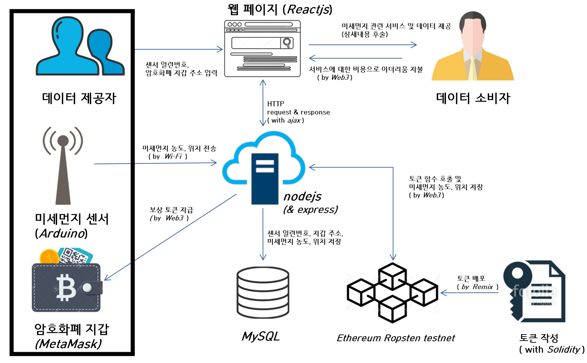

# DustToken
  측정한 미세먼지 농도를 전송해준 사람에게 보상으로 암호화폐 토큰을 주고,
전송받은 미세먼지 농도를 이용해서 소비자들에게 미세먼지 예측, 알림 및 데이터 공유 등의 서비스를 제공하는 
Ethereum 기반 플랫폼 입니다.

  

  

## Directory
- **Client**    : reactjs, css 코드 저장
- **Ethereum**  : solidity 코드 저장
- **Resources** : 로고, 이미지 저장
- **Sensor**    : arduino firmware 코드 저장
- **Server**    : nodejs 코드 저장
   

## 구성원
- 멘토: 조철현 (ecomxasia)
- 팀장: 이동승 (LeeDongSeung)
- 팀원: 조용현 (rafaelcho)
- 팀원: 서현규 (omnipede)
   

## 기술구조

  

