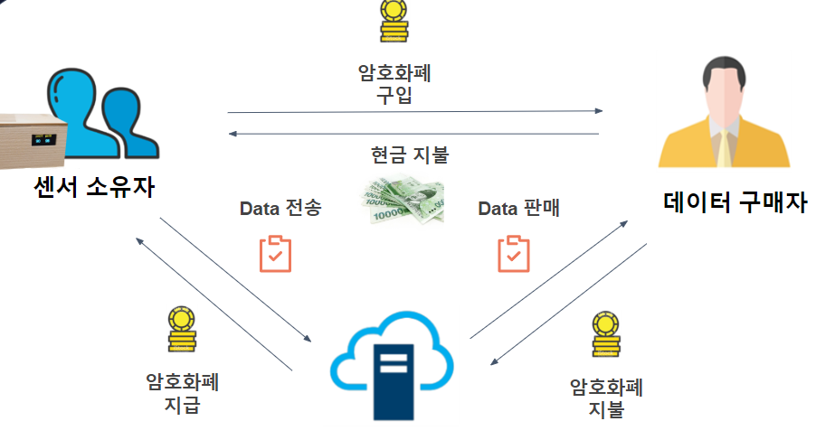
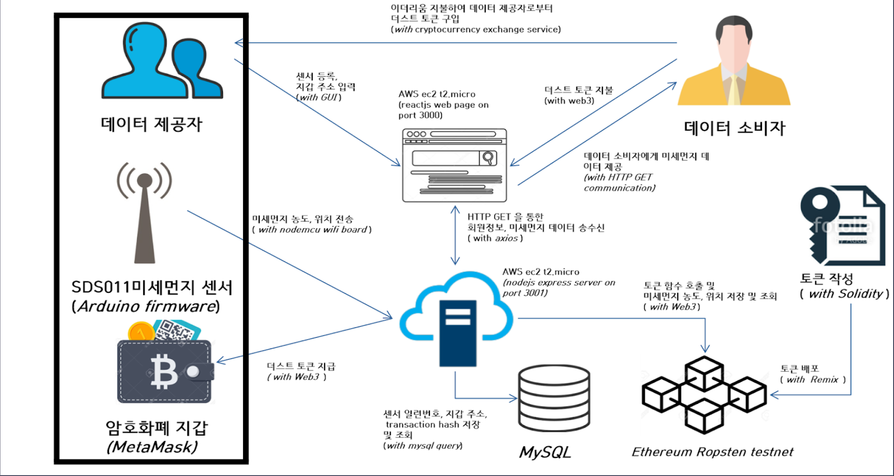

# DustToken
  측정한 미세먼지 농도를 전송해준 사람에게 보상으로 암호화폐 토큰을 주고,
전송받은 미세먼지 농도를 필요한 사람에게 판매하는 블록체인 기반 시스템입니다. 
Ethereum 기반 플랫폼 입니다.
<p align="center">
  
</p>  

## Directory
- ```Client```    : reactjs로 구현한 웹페이지 코드 저장
- ```Ethereum```  : solidity로 구현한 암호화폐 코드 저장
- ```Resources``` : 로고, 이미지등 리소스 저장
- ```Sensor```    : arduino firmware 센서 코드 저장
- ```Server```    : nodejs로 구현한 서버 코드 저장
<br>  

## 구성원
- 멘토: 조철현 (ecomxasia), 김종광 (jongkwang)
- 팀장: 이동승 (LeeDongSeung)
- 팀원: 조용현 (rafaelcho)
- 팀원: 서현규 (omnipede)
<br>  

## 기술구조
<p align="center">
  
</p>
